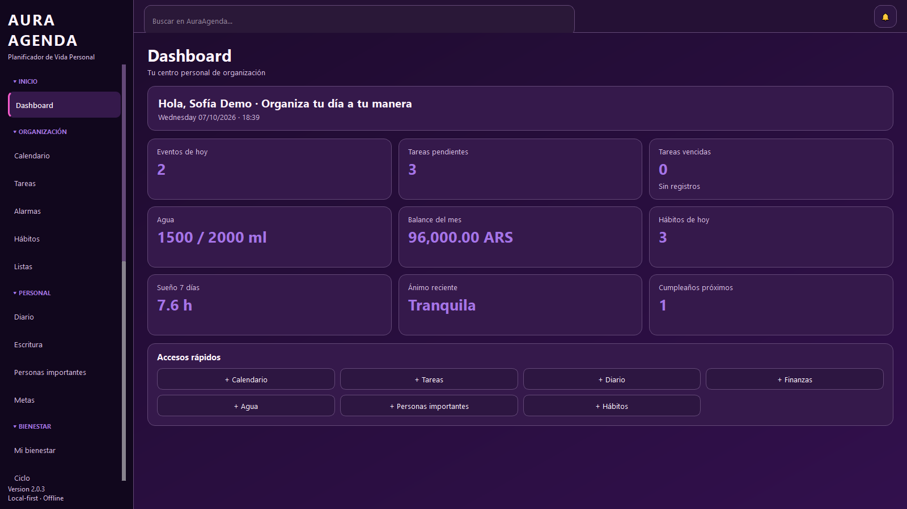
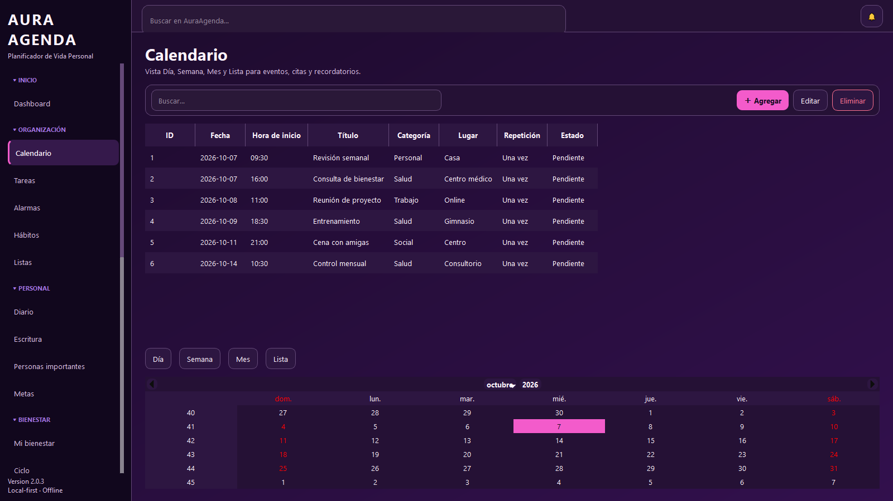
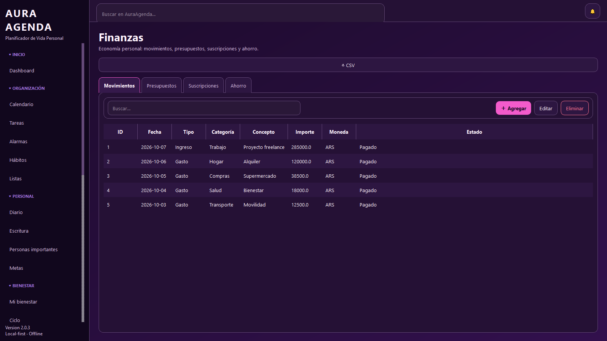
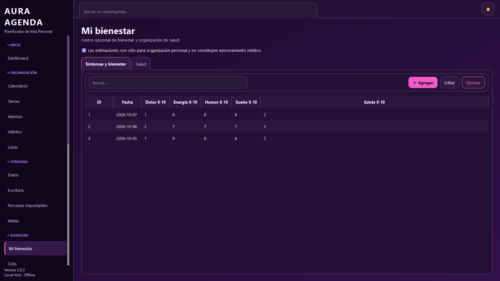
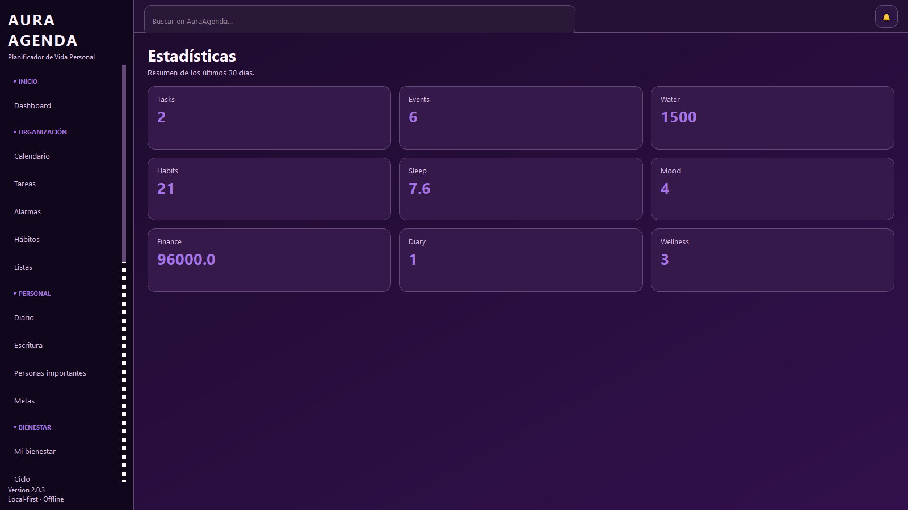
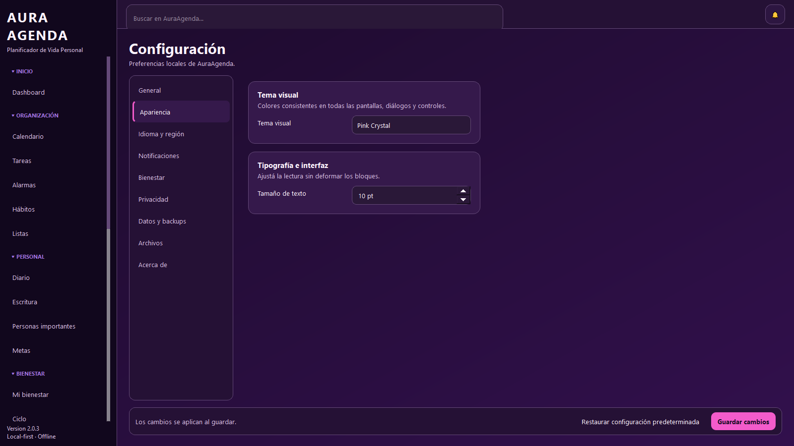
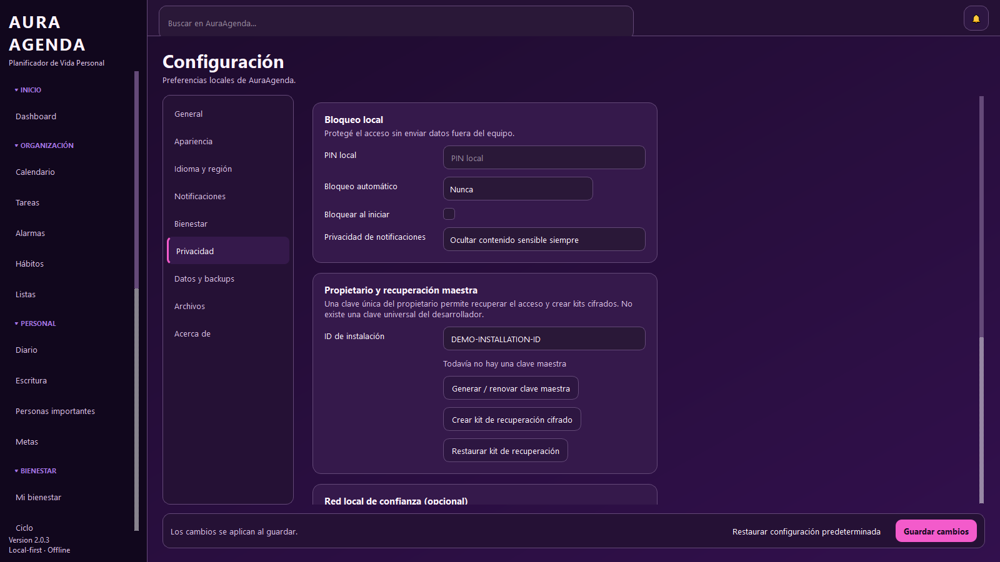

# AuraAgenda

**Personal Life Planner — Windows desktop · Local-first · Privacy-focused**

AuraAgenda 2.0.4 is a complete Windows desktop personal life planner built with Python, PySide6 and SQLite.

The application is designed around a local-first architecture: personal information is stored on the user's device, without requiring a cloud account or a permanent remote service.

## Screenshots

All screenshots below were captured directly from the real AuraAgenda PySide6 application using an isolated demo database with synthetic data. No personal production data is included.

### Dashboard



### Calendar



### Finance



### Wellness



### Statistics



### Settings



### Privacy & Security



## Main capabilities

- dashboard and quick actions;
- calendar with day, week, month and list workflows;
- tasks, alarms, habits and checklists;
- diary, writing, goals and important people;
- wellness, cycle, water, sleep, mood and self-care modules;
- beauty and personal style modules;
- finances, travel, library and multimedia projects;
- statistics, backups, trash/recovery and configuration;
- Spanish / English internationalization;
- multiple pink/violet visual themes;
- local PIN protection;
- owner-controlled master recovery;
- encrypted `.aurarecovery` recovery kits;
- optional trusted local IPv4/CIDR guard;
- hardened backup validation.

## Security model

AuraAgenda is designed without a universal developer password or hidden recovery backdoor.

Each installation can create its own owner master recovery key.

Recovery kits use:

- AES-256-GCM authenticated encryption;
- scrypt-derived encryption keys;
- unique cryptographic salt and nonce;
- owner-controlled recovery credentials.

The optional trusted-network feature uses only local IPv4/CIDR information as an additional restriction. An IP address is not treated as authentication.

AuraAgenda does not query a public-IP service and does not expose a remote-control server or network listener.

The normal SQLite database is not claimed to be encrypted at rest. The application PIN protects access through the AuraAgenda interface, while encrypted recovery kits provide a separately protected recovery mechanism.

See:

- `SECURITY.md`
- `SECURITY_RECOVERY.md`
- `PRIVACY.md`

for the complete security model and limitations.

## Local data

Personal runtime data is stored outside the Git repository in the user's Windows profile.

The repository does not require personal databases, backups, logs, recovery kits or credentials.

`.gitignore` excludes common sensitive/runtime artifacts including:

- `.env` files;
- SQLite databases;
- logs;
- backups;
- private keys and certificates;
- virtual environments;
- `.aurarecovery` files.

## Run AuraAgenda on Windows

### Recommended source launcher

1. Install Python 3.11 or Python 3.12.
2. Clone or download this repository.
3. Open the AuraAgenda directory.
4. Double-click:

`INICIAR_AURAAGENDA.bat`

The launcher:

- creates a local `.venv`;
- installs runtime dependencies inside that environment;
- starts AuraAgenda.

After installation, normal startup can use:

`run_windows.bat`

### Recovery launcher

Encrypted recovery kits can be restored using:

`RECUPERAR_AURAAGENDA.bat`

## Technologies

- Python 3.11 / 3.12
- PySide6 / Qt
- SQLite
- cryptography
- zoneinfo + tzdata
- unittest
- Ruff
- pip-audit
- GitHub Actions
- Dependabot

## Quality and security validation

Local validation:

```bash
python -m compileall -q .
python -m unittest discover -s tests -v
python -m ruff check app tests --select F,E9
python -m pip_audit -r requirements.txt